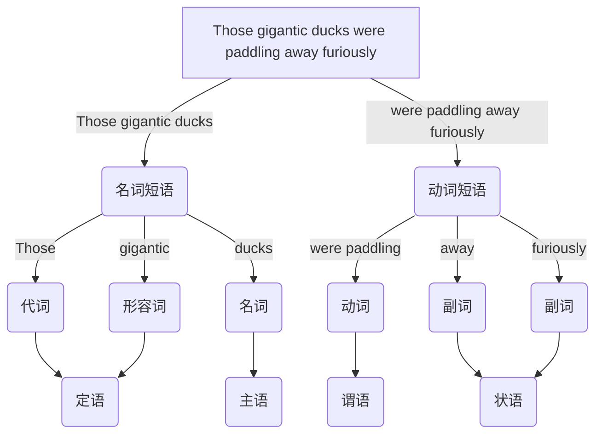

##### 英语说明
- 英语说明
	- 本文档试图提供一个融洽的语法框架, 表述难免存在矛盾冲突, 也会忽视细枝末节的语法比如单个词的应用. 在[[自然语言]]语法理论中, 功能语法强调句子的语法功能, 如主语表示主题, 宾语表示受事, 适合快速理解句子核心意义, 而成分语法将句子分析为若干层次的短语成分, 强调句法结构的分层性和形式化, 如主语通常对应名词短语, 谓语对应动词短语. [[递归]]性是短语结构的核心原则, 句子是由短语逐层嵌套构成的. 下图是自然语言的语法树类似于编程语言的抽象语法树, 用于生成语法理论和自然语言处理等. 但是不管什么语法, 有限的规则难以完全表示自然语言, 总有例外难以自洽
	- 英语单词库设计标签与记忆属性, 具体参考 [OpenWords](https://github.com/insile/OpenWords) 插件. 每个单词统一小写, 自行辨认需要大写的单词, 存在意义不明和使用频率很低的词汇或词性. 同一词根借助前缀或后缀存在很多派生词. 专有名词不全例如国家, 城市等. 由于文件名不能为 `con` 该单词换为 `con'`. 英语短语按作用词性由作者人工分类, 可能有误. [[英语词法]]页面只索引一些比较重要的单词, [[英语单词]]页面会索引全部
		- 必修 小学 / 中考 (去除小学词汇) / 高考四级 (去除小学, 中考词汇)
		- 选修 考研 / 六级 / 雅思 / 托福 / GRE  (去除必修词汇)
		- 必修单词为单标签, 意思是每个单词只有一个类别标签, 不是 `#初中` 就是 `#高中`
		- 选修单词为复合标签, 意思是每个单词有多个类别标签, 可能同时包含 `#六级` 和 `#雅思`

